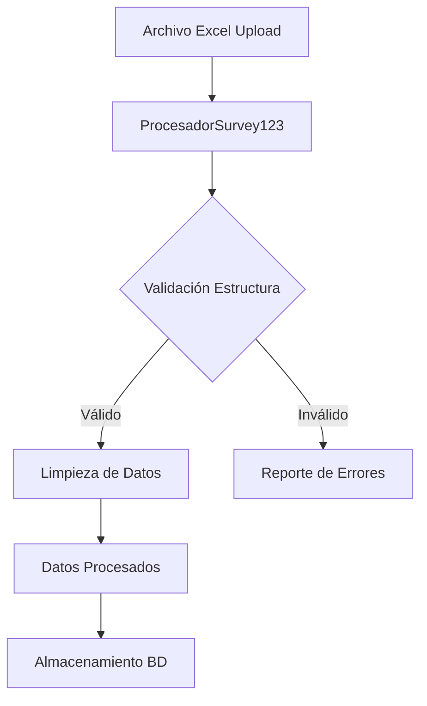
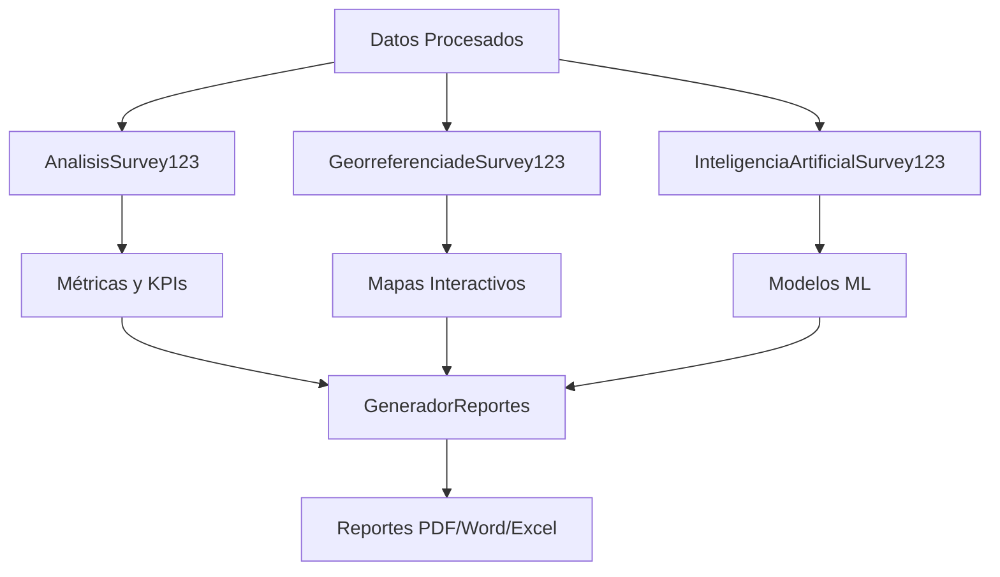
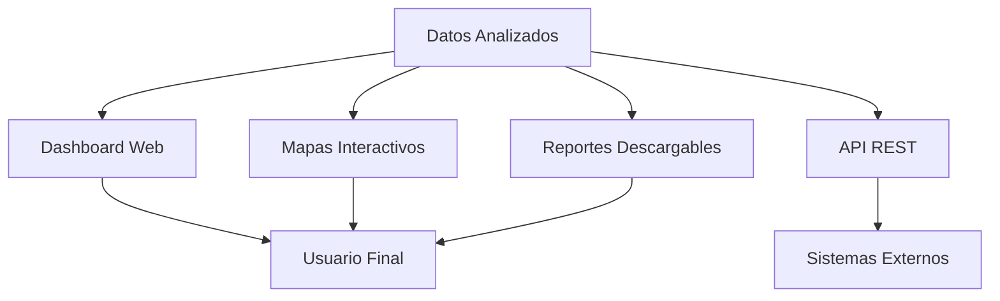

# Documentación Técnica - Módulos del Sistema

## Secretaría de Infraestructura Física de Medellín
### Sistema de Análisis Survey123

---

## Índice

1. [Arquitectura del Sistema](#arquitectura-del-sistema)
2. [Módulo de Ingesta](#módulo-de-ingesta)
3. [Módulo de Modelos](#módulo-de-modelos)
4. [Módulo de Análisis](#módulo-de-análisis)
5. [Módulo de Reportes](#módulo-de-reportes)
6. [Módulo de Georreferenciación](#módulo-de-georreferenciación)
7. [Módulo de Inteligencia Artificial](#módulo-de-inteligencia-artificial)
8. [API de Integración](#api-de-integración)
9. [Flujo de Datos](#flujo-de-datos)
10. [Guía de Desarrollo](#guía-de-desarrollo)

---

## Arquitectura del Sistema

El sistema está diseñado con una arquitectura modular que permite:

- **Escalabilidad**: Cada módulo puede evolucionar independientemente
- **Mantenibilidad**: Separación clara de responsabilidades
- **Reutilización**: Componentes reutilizables entre diferentes procesos
- **Testabilidad**: Cada módulo puede ser probado de forma aislada

```
aplicacion-web/
├── app.py                 # Aplicación principal Flask
├── config.py              # Configuración del sistema
├── requirements.txt       # Dependencias
├── modulos/
│   ├── __init__.py
│   ├── ingesta.py         # Procesamiento de archivos Survey123
│   ├── modelos.py         # Modelos de datos y validación
│   ├── analisis.py        # Análisis estadístico y métricas
│   ├── reportes.py        # Generación de reportes PDF/Word/Excel
│   ├── georreferenciacion.py  # Mapas y análisis geográfico
│   └── inteligencia_artificial.py  # ML y análisis predictivo
├── templates/             # Plantillas HTML
├── static/               # Archivos estáticos (CSS, JS, imágenes)
├── datos/                # Directorio de datos
└── docs/                 # Documentación
```

---

## Módulo de Ingesta

**Archivo**: `modulos/ingesta.py`

### Propósito
Procesa y valida archivos Excel de Survey123, convirtiendo datos raw en formato estructurado.

### Clases Principales

#### `ProcesadorSurvey123`

**Funcionalidades**:
- Validación de estructura de archivos Excel
- Limpieza y transformación de datos
- Detección de errores y inconsistencias
- Conversión de tipos de datos
- Generación de reportes de validación

**Métodos Principales**:

```python
def cargar_archivo(self, ruta_archivo: str) -> Dict[str, Any]
def validar_estructura(self) -> Dict[str, Any]
def limpiar_datos(self) -> pd.DataFrame
def detectar_errores(self) -> List[Dict[str, Any]]
def generar_reporte_carga(self) -> Dict[str, Any]
```

**Ejemplo de Uso**:
```python
from modulos.ingesta import ProcesadorSurvey123

procesador = ProcesadorSurvey123()
resultado = procesador.cargar_archivo('datos/survey123.xlsx')
datos_limpios = procesador.limpiar_datos()
reporte = procesador.generar_reporte_carga()
```

### Validaciones Implementadas

1. **Estructura del archivo**:
   - Verificación de columnas obligatorias
   - Validación de tipos de datos
   - Detección de columnas faltantes

2. **Integridad de datos**:
   - Valores nulos en campos críticos
   - Rangos válidos para coordenadas
   - Fechas en formato correcto

3. **Consistencia**:
   - IDs únicos
   - Estados válidos de obra
   - Relaciones entre campos

---

## Módulo de Modelos

**Archivo**: `modulos/modelos.py`

### Propósito
Define modelos de datos, esquemas de validación y estructuras de base de datos.

### Clases Principales

#### `EsquemaSurvey123`
Define la estructura y validaciones de los datos de Survey123.

#### `ValidadorDatos`
Implementa reglas de negocio y validaciones específicas.

#### `ConexionBD`
Maneja conexiones y operaciones de base de datos.

**Campos del Esquema**:

```python
CAMPOS_OBLIGATORIOS = [
    'Shape', 'X', 'Y', 'id_punto', 'estado_obr', 'fecha_dilig'
]

TIPOS_DATOS = {
    'X': float,
    'Y': float,
    'cant_ayuda': int,
    'cant_ofici': int,
    'horas_retr': float,
    'fecha_dilig': datetime
}

VALORES_VALIDOS = {
    'estado_obr': ['En ejecución', 'Terminada', 'Suspendida', 'Programada']
}
```

---

## Módulo de Análisis

**Archivo**: `modulos/analisis.py`

### Propósito
Realiza análisis estadístico, genera métricas e insights de los datos procesados.

### Clases Principales

#### `AnalisisSurvey123`

**Capacidades**:
- Análisis descriptivo de datos
- Cálculo de KPIs de infraestructura
- Análisis temporal de obras
- Estadísticas de recursos humanos
- Análisis de maquinaria y equipos

**Métodos de Análisis**:

```python
def calcular_metricas_generales(self) -> Dict[str, Any]
def analizar_recursos_humanos(self) -> Dict[str, Any]
def analizar_maquinaria(self) -> Dict[str, Any]
def analizar_actividades_preliminares(self) -> Dict[str, Any]
def analizar_demoliciones_excavaciones(self) -> Dict[str, Any]
def generar_dashboard_metricas(self) -> go.Figure
def generar_reporte_kpis(self) -> Dict[str, Any]
```

### KPIs Calculados

1. **Generales**:
   - Total de obras
   - Distribución por estado
   - Duración del proyecto
   - Cobertura geográfica

2. **Recursos Humanos**:
   - Total de personal asignado
   - Promedio de personal por obra
   - Distribución oficiales/ayudantes

3. **Eficiencia**:
   - Horas de retraso totales
   - Porcentaje de obras con retraso
   - Obras por día promedio

4. **Geográficos**:
   - Puntos únicos de intervención
   - Rango de coordenadas
   - Densidad de obras por zona

---

## Módulo de Reportes

**Archivo**: `modulos/reportes.py`

### Propósito
Genera reportes profesionales en múltiples formatos (PDF, Word, Excel) con gráficos y análisis.

### Clases Principales

#### `GeneradorReportes`

**Formatos Soportados**:
- PDF con ReportLab
- Word con python-docx
- Excel con openpyxl

**Componentes del Reporte**:

1. **Portada Institucional**:
   - Logo de la Secretaría
   - Información del período
   - Metadatos del reporte

2. **Resumen Ejecutivo**:
   - KPIs principales
   - Gráficos de estado
   - Conclusiones clave

3. **Análisis Detallado**:
   - Tablas de datos
   - Gráficos estadísticos
   - Mapas georreferenciados

4. **Anexos**:
   - Datos raw
   - Metodología
   - Glosario

**Ejemplo de Uso**:
```python
from modulos.reportes import GeneradorReportes

generador = GeneradorReportes(datos, metricas)
archivos = generador.generar_reporte_completo(formato='todos')
# Genera: informe.pdf, informe.docx, informe.xlsx
```

---

## Módulo de Georreferenciación

**Archivo**: `modulos/georreferenciacion.py`

### Propósito
Procesa datos geográficos, genera mapas interactivos y realiza análisis espacial.

### Clases Principales

#### `GeorreferenciadeSurvey123`

**Funcionalidades**:
- Validación de coordenadas
- Generación de mapas interactivos con Folium
- Análisis de densidad geográfica
- Exportación a formatos GIS (GeoJSON, Shapefile, KML)

**Tipos de Mapas**:

1. **Mapa Principal**:
   - Todas las obras con clustering
   - Códigos de color por estado
   - Popups informativos

2. **Mapas por Estado**:
   - Filtrado por estado de obra
   - Análisis específico por categoría

3. **Mapa de Calor**:
   - Densidad de obras por zona
   - Identificación de hotspots

**Configuración para Medellín**:
```python
LIMITES_MEDELLIN = {
    'lat_min': 6.1, 'lat_max': 6.4,
    'lon_min': -75.7, 'lon_max': -75.5
}

CENTRO_MEDELLIN = {'lat': 6.2442, 'lon': -75.5812}

COLORES_ESTADOS = {
    'En ejecución': '#FF6B35',
    'Terminada': '#28A745',
    'Suspendida': '#DC3545',
    'Programada': '#007BFF'
}
```

---

## Módulo de Inteligencia Artificial

**Archivo**: `modulos/inteligencia_artificial.py`

### Propósito
Aplica técnicas de machine learning y NLP para análisis predictivo y detección de patrones.

### Clases Principales

#### `InteligenciaArtificialSurvey123`

**Capacidades de ML**:

1. **Predicción de Duración**:
   - Random Forest Regressor
   - Variables: personal, equipos, actividades
   - Métricas: MSE, R²

2. **Detección de Anomalías**:
   - Isolation Forest
   - Identificación de obras atípicas
   - Scoring de anomalías

3. **Clustering de Obras**:
   - K-Means clustering
   - Agrupación por características similares
   - Análisis de centroides

4. **Análisis de Texto (NLP)**:
   - Procesamiento de observaciones
   - Análisis de sentimientos
   - Extracción de temas

**Ejemplo de Predicción**:
```python
from modulos.inteligencia_artificial import InteligenciaArtificialSurvey123

ia = InteligenciaArtificialSurvey123(datos)
prediccion = ia.predecir_duracion_obra(['cant_ayuda', 'cant_ofici'])
anomalias = ia.detectar_anomalias()
clusters = ia.analizar_clustering_obras(n_clusters=3)
```

### Algoritmos Implementados

1. **Random Forest**: Predicción de duración de obras
2. **Isolation Forest**: Detección de anomalías
3. **K-Means**: Clustering de obras similares
4. **VADER Sentiment**: Análisis de sentimientos en texto
5. **TF-IDF**: Extracción de términos relevantes

---

## API de Integración

### Endpoints Principales

#### Carga de Datos
```
POST /api/cargar-datos
Content-Type: multipart/form-data

Response:
{
  "status": "success",
  "archivo_procesado": "survey123_20240101.xlsx",
  "registros_procesados": 67,
  "errores": [],
  "tiempo_procesamiento": 2.3
}
```

#### Análisis Completo
```
GET /api/analisis/{archivo_id}

Response:
{
  "metricas_generales": {...},
  "recursos_humanos": {...},
  "analisis_geografico": {...},
  "kpis": {...}
}
```

#### Generación de Reportes
```
POST /api/generar-reporte
{
  "archivo_id": "123",
  "formato": "pdf",
  "incluir_graficos": true
}

Response:
{
  "status": "success",
  "url_descarga": "/descargas/informe_123.pdf",
  "tiempo_generacion": 5.2
}
```

#### Mapas Interactivos
```
GET /api/mapa/{archivo_id}?tipo=principal&incluir_cluster=true

Response:
{
  "url_mapa": "/mapas/mapa_123.html",
  "coordenadas_centro": [6.2442, -75.5812],
  "total_puntos": 67
}
```

---

## Flujo de Datos

### 1. Ingesta y Validación



### 2. Procesamiento y Análisis



### 3. Visualización y Entrega



---

## Guía de Desarrollo

### Configuración del Entorno

1. **Instalación de Dependencias**:
```bash
pip install -r requirements.txt
```

2. **Variables de Entorno**:
```bash
export FLASK_ENV=development
export SECRET_KEY=your-secret-key
export DATABASE_URL=sqlite:///survey123.db
```

3. **Inicialización de la Base de Datos**:
```bash
python -c "from modulos.modelos import crear_tablas; crear_tablas()"
```

### Estructura de Testing

```
tests/
├── test_ingesta.py
├── test_analisis.py
├── test_reportes.py
├── test_georreferenciacion.py
├── test_ia.py
└── fixtures/
    └── sample_survey123.xlsx
```

### Ejemplo de Test

```python
import unittest
from modulos.ingesta import ProcesadorSurvey123

class TestProcesadorSurvey123(unittest.TestCase):
    
    def setUp(self):
        self.procesador = ProcesadorSurvey123()
    
    def test_cargar_archivo_valido(self):
        resultado = self.procesador.cargar_archivo('tests/fixtures/sample_survey123.xlsx')
        self.assertEqual(resultado['status'], 'success')
        self.assertGreater(resultado['registros_procesados'], 0)
    
    def test_validacion_coordenadas(self):
        # Implementar test de validación
        pass
```

### Logging y Monitoreo

```python
import logging

# Configuración de logging
logging.basicConfig(
    level=logging.INFO,
    format='%(asctime)s - %(name)s - %(levelname)s - %(message)s',
    handlers=[
        logging.FileHandler('logs/survey123.log'),
        logging.StreamHandler()
    ]
)

logger = logging.getLogger(__name__)
```

### Optimizaciones de Rendimiento

1. **Caché de Resultados**:
```python
from functools import lru_cache

@lru_cache(maxsize=128)
def calcular_metricas_pesadas(datos_hash):
    # Cálculos costosos
    return resultados
```

2. **Procesamiento Asíncrono**:
```python
from celery import Celery

app = Celery('survey123')

@app.task
def procesar_archivo_asincrono(ruta_archivo):
    # Procesamiento en background
    return resultado
```

3. **Optimización de Consultas**:
```python
# Usar índices en columnas frecuentemente consultadas
# Limitar resultados con paginación
# Usar proyecciones para campos específicos
```

---

## Mejores Prácticas

### 1. Manejo de Errores
```python
try:
    resultado = procesar_datos(archivo)
except ValidationError as e:
    logger.error(f"Error de validación: {e}")
    return {"error": "Datos inválidos", "detalle": str(e)}
except Exception as e:
    logger.exception("Error inesperado en procesamiento")
    return {"error": "Error interno del servidor"}
```

### 2. Validación de Entrada
```python
def validar_archivo_entrada(archivo):
    if not archivo.filename.endswith('.xlsx'):
        raise ValueError("Solo se permiten archivos Excel")
    
    if archivo.content_length > 10 * 1024 * 1024:  # 10MB
        raise ValueError("Archivo demasiado grande")
```

### 3. Documentación de Código
```python
def calcular_kpi_eficiencia(datos: pd.DataFrame) -> float:
    """
    Calcula el KPI de eficiencia de obras.
    
    Args:
        datos: DataFrame con información de obras
        
    Returns:
        Valor del KPI entre 0 y 1
        
    Raises:
        ValueError: Si los datos no contienen columnas requeridas
    """
```

---

## Contacto y Soporte

**Equipo de Desarrollo**:
- Email: soporte@medellin.gov.co
- Repositorio: [GitHub Interno]
- Documentación: [Confluence]

**Para Reportar Bugs**:
1. Usar el sistema de tickets interno
2. Incluir logs relevantes
3. Proporcionar pasos para reproducir
4. Especificar entorno (desarrollo/producción)

---

*Documento generado automáticamente - Versión 1.0*
*Última actualización: {{ datetime.now().strftime('%d/%m/%Y') }}*
